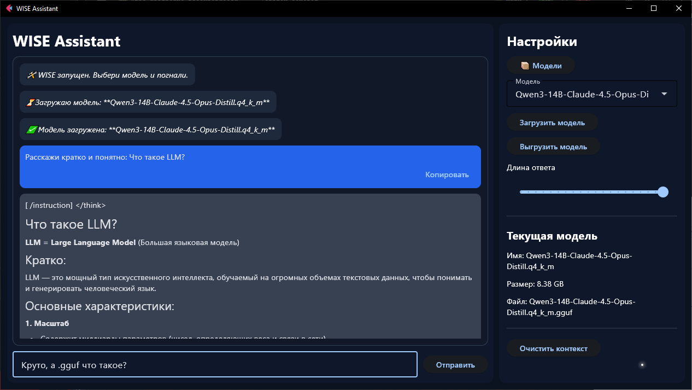

# 🧠 WISE Assistant

<p align="center">
  <b>Локальный ИИ-ассистент с поддержкой GGUF моделей</b><br>
  Работает полностью оффлайн и использует GPU для ускорения
</p>

<p align="center">
  
  
  
  
  
</p>

---

## 🚀 Возможности

- 💬 Чат с локальной моделью  
- ⚡ GPU ускорение (CUDA)  
- 📦 Менеджер моделей (импорт / удаление)  
- 🎨 Markdown + подсветка кода  
- 📋 Копирование сообщений  
- 🔧 Настройка генерации  

---

## 📦 Билды (Releases)

В разделе **Releases** доступны разные версии:

- 🟢 **CUDA build (RTX 40xx / Ada)** — максимальная производительность  
- 🟡 **Другие GPU билды** — под разные видеокарты  
- ⚪ **CPU build** — работает без GPU  

👉 Выбирай билд под своё железо

---

## ⚙️ Системные требования

❗ **Фиксированных требований нет** — всё зависит от модели

### 🟢 Лёгкие модели
- TinyLlama 1B  
- Qwen 2 4B  

**Пример:**
- RAM: ~8 GB  
- GPU: не обязателен  

👉 Работает почти на любом ПК  

---

### 🟡 Средние модели (рекомендуется)
- Mistral 7B  
- LLaMA 3 8B  

**Пример:**
- RAM: ~16 GB  
- GPU: желательно  
- VRAM: 6–10 GB  

👉 Лучший баланс качества и скорости  

---

## ▶️ Запуск

1. Скачай билд из **Releases**
2. Распакуй архив
3. Запусти:

```bash
main.exe
```
---
## 📂 Модели

Положи `.gguf` модели в папку:
```bash
/models
```

или импортируй через интерфейс.

---

## 🖼 Интерфейс

> сюда потом вставишь скрин



---

## ⚠️ Важно

- модели в репозитории не хранятся  
- большие модели требуют много RAM/VRAM  
- без GPU будет медленно  

---

## 📌 Итог

WISE Assistant — это локальный аналог ChatGPT, где:

- 🔒 всё работает оффлайн  
- 🧠 ты сам выбираешь модель  
- ⚡ используешь мощность своего ПК  
